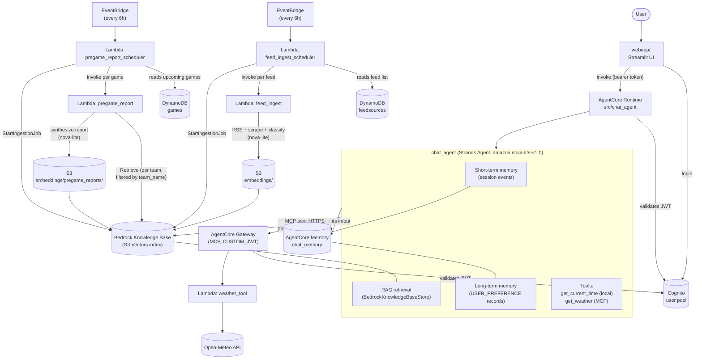

# agentcore-demo

A sports-team chat assistant built on **Amazon Bedrock AgentCore** and the **Strands Agents SDK**. It demonstrates a full production-shaped agent stack: a streaming chat agent with short-term conversational memory and long-term user-preference memory, retrieval-augmented generation (RAG) over an auto-updating RSS ingestion pipeline, a Lambda-backed tool exposed via an AgentCore Gateway (MCP), a Streamlit webapp, Cognito auth, and a Terraform stack that provisions all of it.

## Architecture



**Request path:** a user logs into the webapp via Cognito, then every chat message is POSTed to the AgentCore Runtime's HTTPS invoke endpoint with the user's bearer token. The Runtime hosts a Strands `Agent` that, each turn, replays the conversation from short-term memory, pulls in relevant long-term preferences and RAG passages, calls tools as needed, and streams the reply back over SSE.

**Ingestion path (independent of chat):** every 6 hours, EventBridge triggers a scheduler Lambda that reads a table of (team, RSS feed) pairs, fetches and classifies new articles, writes them to S3, and kicks off a Bedrock Knowledge Base ingestion job — so the RAG content refreshes itself without any chat traffic.

**Pregame report path (also independent of chat):** every 6 hours, a second EventBridge schedule triggers `pregame_report_scheduler`, which reads a table of upcoming games and, for each one starting soon, has `pregame_report` retrieve each team's recent knowledge-base coverage, ask `nova-lite` to synthesize a matchup report from it, and write that report to S3 under its own prefix — feeding the same Knowledge Base ingestion job as the news pipeline, so pregame reports become chat-retrievable too. See [How pregame reports work](#how-pregame-reports-work) below.

## Components

### `src/chat_agent/` — the agent

The core of the system. A [Strands](https://strandsagents.com/) `Agent` running inside a `BedrockAgentCoreApp` (`bedrock-agentcore` SDK), deployed as a container to the Bedrock AgentCore Runtime. See [chat_agent.py](src/chat_agent/chat_agent.py).

- **Model**: `amazon.nova-lite-v1:0` (comments in the code record why `nova-micro` and tool-name conventions like `<target>___<tool>` were rejected — both threw `modelStreamErrorException` on tool calls).
- **Entrypoint** (`invoke`): dispatches on `payload["action"]` — `chat` (default, streamed), `list_sessions`, `list_messages`, `debug_info`. It deliberately stays a non-`async generator` function so the runtime can tell streaming and plain-JSON responses apart via `inspect.isasyncgen`.
- **Streaming**: chat responses are streamed as Server-Sent Events; the webapp reconstructs text deltas from the underlying Bedrock Converse `contentBlockDelta` events.
- **Deployment**: built from [Dockerfile](src/chat_agent/Dockerfile) (Python 3.14, `opentelemetry-instrument` wrapped) and pushed to ECR via [infra/acdemo/tools/upload-agent-to-ecr.sh](infra/acdemo/tools/upload-agent-to-ecr.sh). The Runtime always tracks the ECR `:latest` tag, so pushing a new image is how agent code changes ship — no Terraform apply required.

### `webapp/` — Streamlit chat UI

A Streamlit app ([app.py](webapp/app.py), [agent_client.py](webapp/agent_client.py), [auth.py](webapp/auth.py), [config.py](webapp/config.py)) with four views: login → home (list of past chats) → chat (streaming) → debug (inspects long-term memory records for the logged-in user).

- Talks to the Runtime's invoke HTTPS endpoint directly — no AWS SDK/credentials needed on the client, just a Cognito bearer token.
- Auth uses an **unsigned** boto3 Cognito client (`USER_PASSWORD_AUTH`, with `NEW_PASSWORD_REQUIRED` challenge handling) — end users never need AWS credentials.
- One AgentCore *actor* per Cognito user (`webapp-<sub>`), one AgentCore *session* per chat (`webapp-<sub>-<conversation id>`) — see [Memory](#how-memory-works) below.
- Run locally with `uv run streamlit run webapp/app.py` (see [webapp/README.md](webapp/README.md) for `.env` setup).

### `src/feed_ingest/` — the RAG data pipeline

Two Lambdas that keep the knowledge base fresh:

- [feed_ingest.py](src/feed_ingest/feed_ingest.py) — given one (team, RSS URL) pair: parses the feed, dedupes against S3 marker objects, scrapes each article's text, calls Bedrock (`nova-lite`) to classify relevance and summarize it for that team, and writes a Markdown document + metadata sidecar to `s3://<source-bucket>/embeddings/`.
- [feed_ingest_scheduler.py](src/feed_ingest/feed_ingest_scheduler.py) — reads every row of the `feedsources` DynamoDB table, invokes `feed_ingest` once per row, and — if any new documents were written — calls `bedrock:StartIngestionJob` to re-index the Knowledge Base. Triggered every 6 hours by an EventBridge rule.

### `src/weather_tool/` — the weather MCP tool

A small Lambda ([weather_tool.py](src/weather_tool/weather_tool.py)) that geocodes a city and fetches current conditions from the free Open-Meteo API. It isn't called directly — it's registered as a target behind an AgentCore Gateway, which exposes it to the agent as an MCP tool (`get_weather`).

### `src/pregame_report/` — the pregame report pipeline

Two more Lambdas, structured the same way as `src/feed_ingest/`, that generate and refresh matchup reports for upcoming games:

- [pregame_report.py](src/pregame_report/pregame_report.py) — given one game (visiting team, home team, kickoff time): retrieves each team's recent Knowledge Base coverage (filtered by the same `team_name` metadata attribute `feed_ingest.py` stamps), asks Bedrock (`nova-lite`) to synthesize a markdown report from it (team snapshots, key player matchups, offense/defense breakdown, notable injuries, outlook), and writes it to `s3://<source-bucket>/embeddings/pregame_reports/` — a prefix separate from `feed_ingest.py`'s own, so pregame reports stay distinguishable from regular news articles even though both feed the same Knowledge Base. Grounded strictly in retrieved content: the synthesis prompt is told not to invent injury/roster specifics the retrieved excerpts don't support. Writes to a deterministic S3 key per game, so re-running overwrites the prior report with fresher news rather than accumulating duplicates.
- [pregame_report_scheduler.py](src/pregame_report/pregame_report_scheduler.py) — reads every row of the `games` DynamoDB table, selects the ones kicking off within a lookahead window (`PREGAME_LOOKAHEAD_DAYS`, default 5 days), invokes `pregame_report` once per selected game, and — if any documents were written — calls `bedrock:StartIngestionJob` to re-index the Knowledge Base. Triggered every 6 hours by its own EventBridge rule.

### `infra/acdemo/` — Terraform stack

Provisions everything above: ECR + IAM for the Runtime, the AgentCore Memory resource + memory strategy, the AgentCore Runtime itself, the Bedrock Knowledge Base + S3 Vectors index, the `feedsources` and `games` DynamoDB tables, the AgentCore Gateway + Lambda target, the Cognito user pool/client, all five Lambdas, and the two EventBridge schedules. See the [Setup](#setup--deployment) section below for how to apply it.

### `tools/` — operational scripts

Shell scripts for exercising and cleaning up AgentCore Memory directly, each paired with an `.env.<name>.template`:

| Script | Purpose |
|---|---|
| [flush_memory.sh](tools/flush_memory.sh) | Delete every short-term event in **one** chat session |
| [flush_all_chats.sh](tools/flush_all_chats.sh) | Delete every session (all chats) for one actor |
| [flush_long_term_memory.sh](tools/flush_long_term_memory.sh) | Delete an actor's long-term `USER_PREFERENCE` records |
| [test_agent.sh](tools/test_agent.sh) | Raw `curl` smoke test against the Runtime invoke endpoint |
| [user_login.sh](tools/user_login.sh) | Mint a Cognito bearer token from the CLI, for use with the above |

## How memory works

The agent uses two distinct tiers of **Bedrock AgentCore Memory**, both backed by a single `aws_bedrockagentcore_memory` resource (`chat_memory`, provisioned in [agentcore_runtime.tf](infra/acdemo/agentcore_runtime.tf)) but serving very different purposes:

**Short-term / conversational memory** — every user and assistant turn is stored as an *event*, keyed by `(memory_id, actor_id, session_id)`, with a 7-day expiry (the minimum the Terraform provider allows). On each invocation, an `AgentCoreMemorySessionManager` attached to the Strands `Agent` transparently replays the full prior event history for that session into `agent.messages` before the turn runs — this is what makes a chat resumable across page loads and devices without the client re-sending its own history. `actor_id` (`webapp-<cognito sub>`) is stable per user, while `session_id` (`webapp-<sub>-<conversation id>`) is one per chat, which is what lets the webapp enumerate a user's full chat list via `list_actor_sessions`.

**Long-term / user-preference memory** — a `USER_PREFERENCE`-type memory strategy (`aws_bedrockagentcore_memory_strategy.user_preferences`) writing into the namespace `/preferences/{actorId}/`. Bedrock automatically extracts durable facts from the conversation (e.g. a favorite team or player) into this namespace — no application code does the extraction. Retrieval is automatic too: the session manager's `retrieval_config` semantically searches this namespace before every turn (`top_k=5`, minimum relevance score `0.3`) and prepends any matches to the user's message as a `<user_context>` block, which the system prompt instructs the model to treat as known facts. This is the personalization layer — it's what lets the agent remember, say, a user's favorite team across brand-new conversations without asking again.

The two tiers differ in retention (7 days vs. indefinite), retrieval style (linear replay vs. relevance-scored semantic search), and purpose (continuity within a chat vs. personalization across chats) — and are exposed through separate AgentCore Memory APIs: `ListEvents`/`DeleteEvent` for short-term, `ListMemoryRecords`/`DeleteMemoryRecord` for long-term. The webapp's Debug page and the `tools/flush_*.sh` scripts operate on exactly these APIs.

## How RAG works

**Ingestion (offline, scheduled, independent of chat traffic):** every 6 hours EventBridge triggers `feed_ingest_scheduler`, which reads the `feedsources` DynamoDB table for (team, RSS URL) pairs and invokes `feed_ingest` once per feed. `feed_ingest` parses the feed, skips articles it's already processed, scrapes the article text, asks `amazon.nova-lite-v1:0` to classify the article's relevance to that team and summarize it, and writes a Markdown document plus a metadata sidecar into the Knowledge Base's S3 source bucket under `embeddings/`. Once new documents exist, the scheduler calls `bedrock:StartIngestionJob`.

**Indexing:** the Bedrock Knowledge Base's S3 data source picks up everything under `embeddings/`, semantically chunks it, embeds it with **Titan Embed Text v2** (1024 dimensions), and stores the vectors in an **S3 Vectors** index (`bedrock_kb.tf`) — this project uses S3 Vectors rather than an OpenSearch Serverless collection for the vector store.

**Retrieval (online, every chat turn):** the agent's `MemoryManager` wraps a `BedrockKnowledgeBaseStore` pointed at the Knowledge Base, configured with `search_tool_config=False` and `injection=True`. That means retrieval is **not** a tool the model chooses to call — relevant passages for the latest user message are unconditionally retrieved and folded into context on every single turn, regardless of whether the message is obviously about ingested content. This sidesteps small models' (`nova-lite`/`nova-micro`) unreliable judgment about *when* to search, at the cost of always paying for a retrieval call.

The knowledge base is intentionally narrow in scope — "team RSS feed articles ingested by feed_ingest" — not a general-purpose document store.

**Retrieval scope, filtering, and size limits:**

- **Chunk-level top-K, not whole documents.** Articles are split into ~300-token semantic chunks at ingestion time and embedded individually, so retrieval works at the chunk granularity, not the article granularity. Each turn, `Retrieve` returns at most the top **10** most similar chunks (`BedrockKnowledgeBaseStore`'s default `max_search_results`, left unconfigured in `chat_agent.py`), and the `MemoryManager` injection layer further caps what actually reaches the model at **5** entries (also its unconfigured default). So a turn sees at most 5 short passages — never a full article, and never the whole knowledge base.
- **The retrieval query is exactly one message, not the conversation.** The injected query is derived adaptively from `agent.messages`: the single most recent message matching the current turn's role (normally the latest user message's text) — never a concatenation or summary of prior turns, even though the full history is present via short-term memory.
- **Filtering is supported but not currently applied.** `feed_ingest.py` stamps five metadata attributes on every document it writes — `team_name` and `title` (both also embedded for semantic matching), plus filter-only `source`, `published_date`, and `url`. `BedrockKnowledgeBaseStore` accepts a `filter` (or `scope`/`scope_metadata_key`) config that becomes a metadata-equals filter on the `Retrieve` call — e.g. scoping results to one team — but `chat_agent.py` sets neither today, so every query searches across all teams' articles, ranked purely by semantic similarity.
- **Size limits worth knowing:** `feed_ingest` caps each run at the 10 newest entries per feed within a 48-hour lookback window; article text is truncated to 12,000 characters before being sent to `nova-lite` for classification; and the S3 `.metadata.json` sidecar is capped at Bedrock's observed 1024-byte limit (the `title`/`url` attributes are defensively truncated to stay under it).

## How pregame reports work

**Game source:** the `games` DynamoDB table, one row per game, keyed by a partition key `gameId` formatted `{year}#{weekType}#{weekNumber}#{VISITING}@{HOME}` (e.g. `2026#PRESEASONWEEK#2#49ers@Chargers` — the `VISITING`/`HOME` shorthand's casing isn't significant) and a sort key `gameTime` (ISO-8601 UTC, e.g. `2026-08-21T02:00:00Z`). `pregame_report_scheduler.py`'s `parse_game_id()` parses `visiting_team`/`home_team` straight out of `gameId` — normalizing the shorthand to the title-cased team name `feed_ingest`/`feedsources` rows use for that team (e.g. `"49ers"`, `"Chargers"`) via `.capitalize()`, which is correct for every NFL nickname regardless of the shorthand's input casing — so rows need no separate `visiting_team`/`home_team` attribute; one can still be set explicitly on a row to override the parsed value (e.g. if a team's shorthand and Knowledge Base casing ever diverge).

**Scheduling (offline, independent of chat traffic):** every 6 hours EventBridge triggers `pregame_report_scheduler`, which scans the `games` table and keeps only the rows whose `gameTime` falls within `PREGAME_LOOKAHEAD_DAYS` (default 5) from now — far-off games are skipped (no fresh news to report on yet), and past games drop out of the window naturally, with no cleanup step required.

**Per-game retrieval + synthesis:** for each selected game, `pregame_report` calls `bedrock-agent-runtime`'s `Retrieve` directly (the same call `BedrockKnowledgeBaseStore.search()` wraps in `chat_agent.py`, but invoked standalone here since this Lambda has no Strands `Agent`), once per team, each filtered to `team_name` equals that team — reusing the metadata attribute `feed_ingest.py` already stamps on every article but that `chat_agent.py` never filters by (see [How RAG works](#how-rag-works) above). The two teams' retrieved excerpts are then handed to one `amazon.nova-lite-v1:0` `converse` call, prompted to write a markdown report covering both teams' recent form, key player matchups, the offense/defense matchup, and notable injuries — explicitly instructed to ground every factual claim in the retrieved excerpts and say so plainly when coverage is thin, rather than inventing injury/roster specifics.

**Write-back into the same Knowledge Base, under a separate key:** the report is written to `s3://<source-bucket>/embeddings/pregame_reports/<slugified game id>.md` — a prefix separate from `feed_ingest.py`'s own `embeddings/<team_slug>/` — with a metadata sidecar carrying embedded `visiting_team`/`home_team` attributes (so a semantic query naming either team can surface the report) plus a non-embedded `doc_type: "pregame_report"` attribute for filtering it apart from regular news articles. The S3 key is deterministic per game, so re-running for the same game **overwrites** the prior report rather than accumulating duplicates — each scheduler run refreshes it with whatever news has landed since. Once at least one report is written, the scheduler calls the same `bedrock:StartIngestionJob` the news pipeline uses, so pregame reports become chat-retrievable through the exact same RAG path described above — no chat-side code change was needed for this.

## How the agent's per-turn context is constructed

Memory and RAG above aren't independent features — they're both assembled into a single model call each turn, alongside tool definitions. In order:

1. **System prompt** — static instructions telling the model how to treat a `<user_context>` block, and to always use `get_current_time`/the weather tool rather than guessing.
2. **Restored conversation history** — before the turn runs, the session manager's `initialize()` hook replays every prior event for this `(actor_id, session_id)` into `agent.messages`.
3. **Long-term preference injection** — the session manager semantically searches `/preferences/{actorId}/` for facts relevant to the new message and prepends them to it as a `<user_context>` block.
4. **RAG injection** — separately, the knowledge-base store retrieves passages relevant to the new message and folds them into context, unconditionally, every turn.
5. **The new user message itself**, now wrapped with the `<user_context>` block from step 3.
6. **Tool definitions** — `get_current_time` always; `get_weather` too, if the Gateway and a caller access token are available this turn (it's loaded fresh via MCP on every invocation and renamed from the Gateway's `get-weather___get_weather` to a plain `get_weather`, since the model chokes on tool names containing `___`).

The assembled `Agent` then streams the reply. Afterward, the full turn (including any tool calls/results) is persisted back into short-term memory as new events, and asynchronously mined for new long-term preference facts — closing the loop for the next turn. Notably, steps 3 and 4 are both automatic and unconditional: this project deliberately never leaves it up to `nova-lite`/`nova-micro` to *decide* whether to pull memory or knowledge-base content — it just injects both, every time.

## Auth & identity flow

A single Cognito user pool/client is used three ways: the webapp authenticates end users against it directly; the AgentCore Runtime's `custom_jwt_authorizer` validates every invoke call against it; and the AgentCore Gateway's `custom_jwt_authorizer` validates every MCP call to the weather tool against the *same* pool. Because the managed Runtime front door consumes the inbound `Authorization` header for its own JWT validation and does not forward it into the container, the caller's bearer token is sent **twice** — once as the header, once again inside the JSON payload as `access_token` — so the agent can re-present it when it, in turn, calls the Gateway as the same user.

## Setup / deployment

1. **Prerequisites**: `uv`, Terraform, Docker with `buildx`, and AWS credentials. [bootstrap.sh](bootstrap.sh) installs these on a fresh Amazon Linux dev box.
2. **Provision infrastructure**:
   ```sh
   cd infra/acdemo
   terraform apply
   ```
   Uses [terraform.tfvars](infra/acdemo/terraform.tfvars) — note it pins an AWS SSO `profile`, which you'll need to change for your own environment.
3. **Push the agent image** (needed after provisioning, and after any agent code change):
   ```sh
   cp infra/acdemo/tools/env.agent.template infra/acdemo/tools/.env.agent   # fill in values
   ./infra/acdemo/tools/upload-agent-to-ecr.sh
   ```
   The Runtime always references the ECR `:latest` tag, so this is how new agent code reaches an already-created Runtime without re-applying Terraform.
4. **Configure the webapp**: copy `webapp/.env.example` to `webapp/.env` and fill it in from `terraform -chdir=infra/acdemo output` and `aws sts get-caller-identity`.
5. **Run the webapp**:
   ```sh
   uv run streamlit run webapp/app.py
   ```
6. **Build/test Lambdas**: `src/Makefile` has `*_dist` targets to package each Lambda as a zip (`feed_ingest_dist`, `feed_ingest_scheduler_dist`, `weather_tool_dist`, `pregame_report_dist`, `pregame_report_scheduler_dist`) and matching `*_test` targets to run `pytest` against `tests/`.
7. **Operational scripts**: see the [tools/](#tools--operational-scripts) table above for flushing memory and smoke-testing the agent directly.

## Repo layout

```
src/chat_agent/     the agent (Strands Agent + BedrockAgentCoreApp), deployed as a container
src/feed_ingest/    RSS → S3 ingestion pipeline feeding the RAG knowledge base
src/weather_tool/   Lambda backing the get_weather MCP tool
src/pregame_report/ scheduled pipeline generating/refreshing pregame matchup reports
webapp/             Streamlit chat UI + Cognito auth
infra/acdemo/       Terraform: Runtime, Memory, Knowledge Base, Gateway, Cognito, Lambdas, DynamoDB
tools/              Shell scripts for testing the agent and flushing memory
tests/              pytest tests for the Lambda components
```
